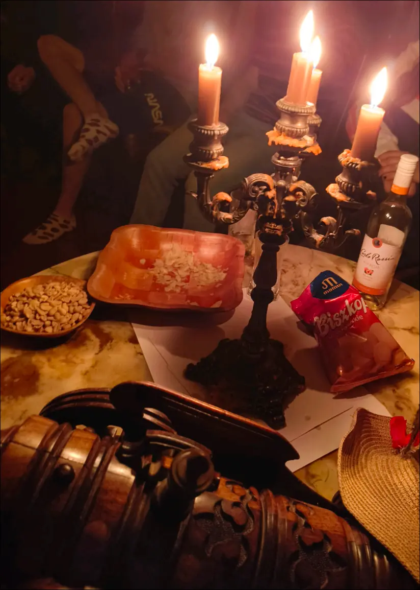
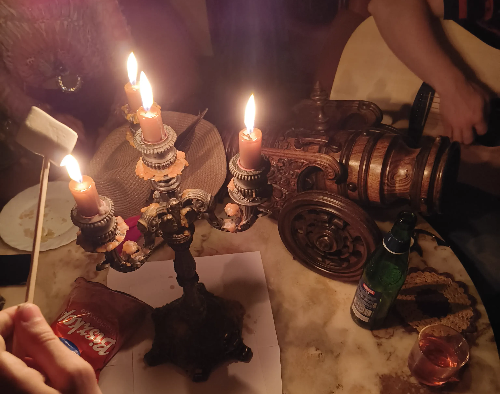
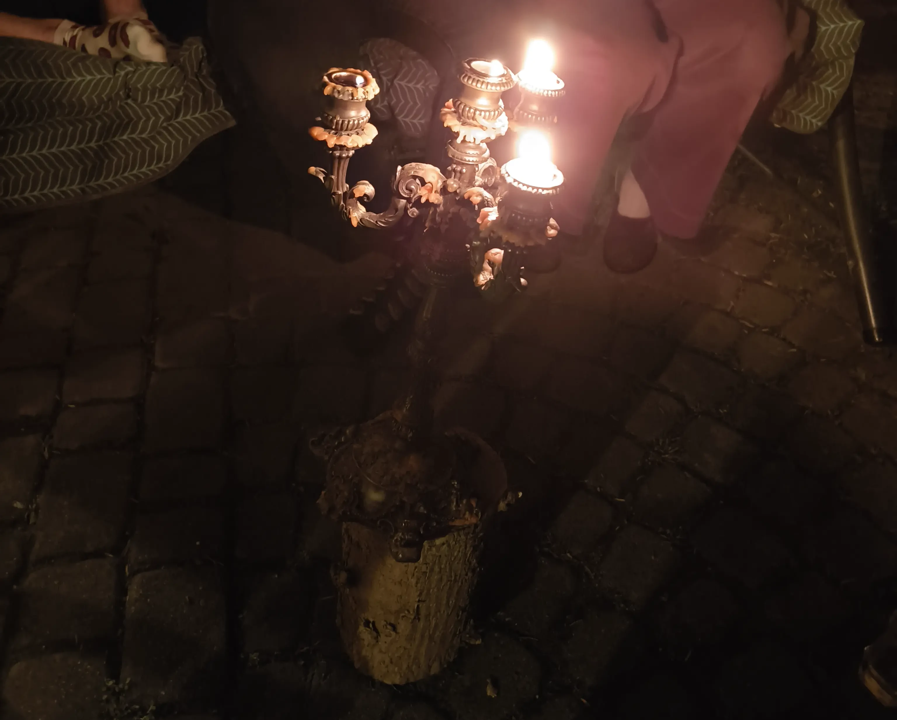
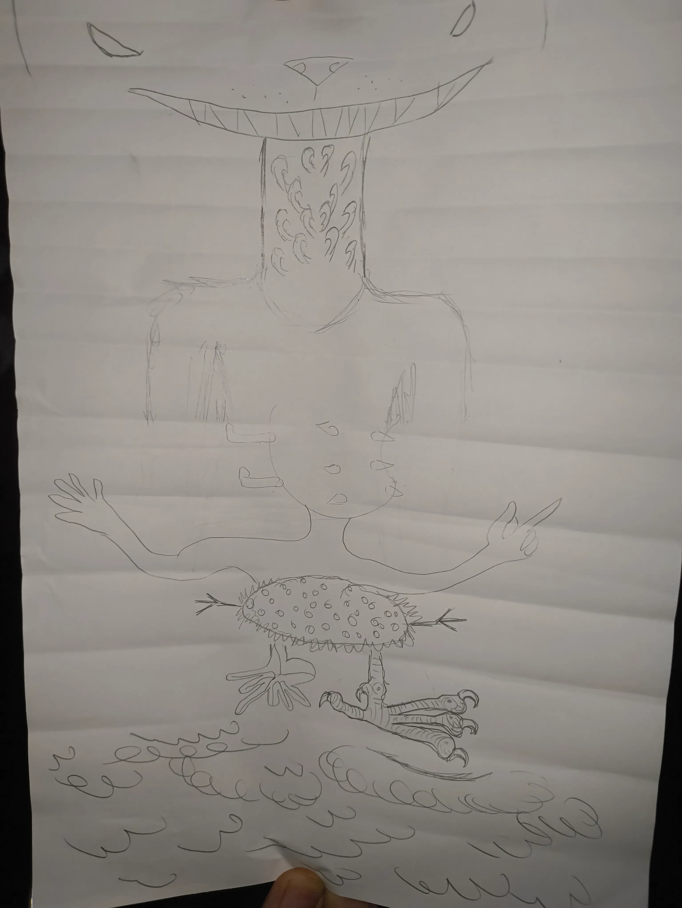
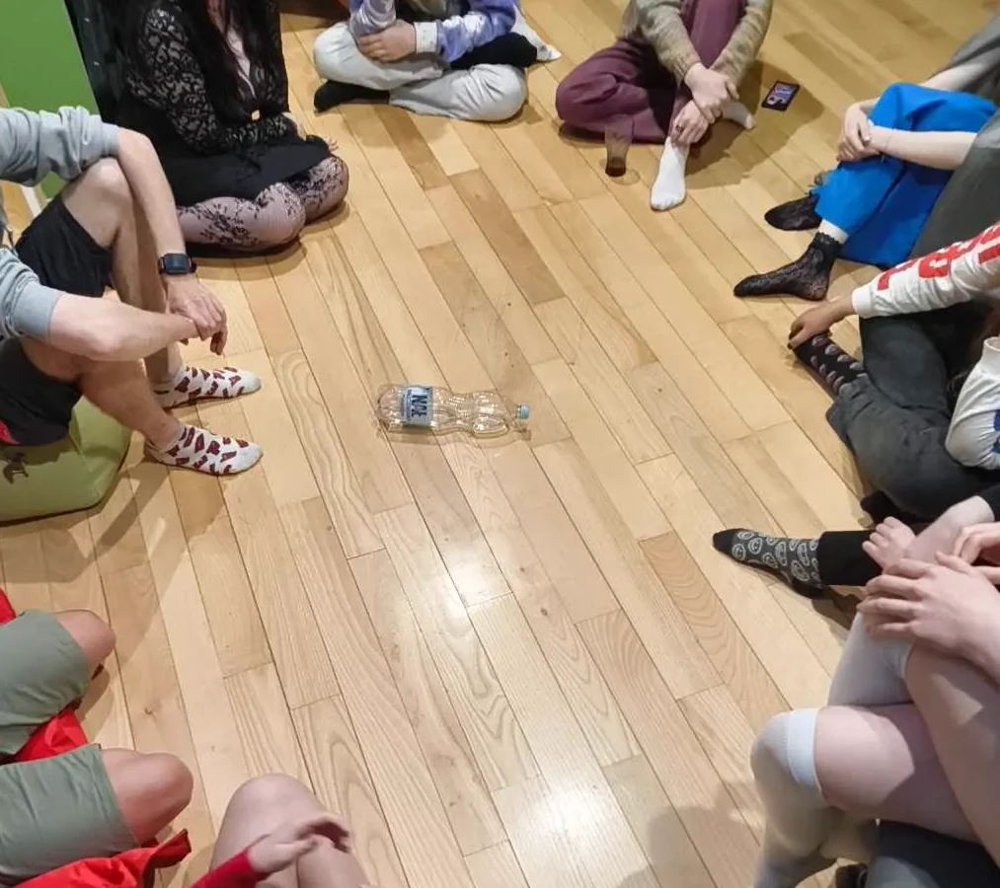
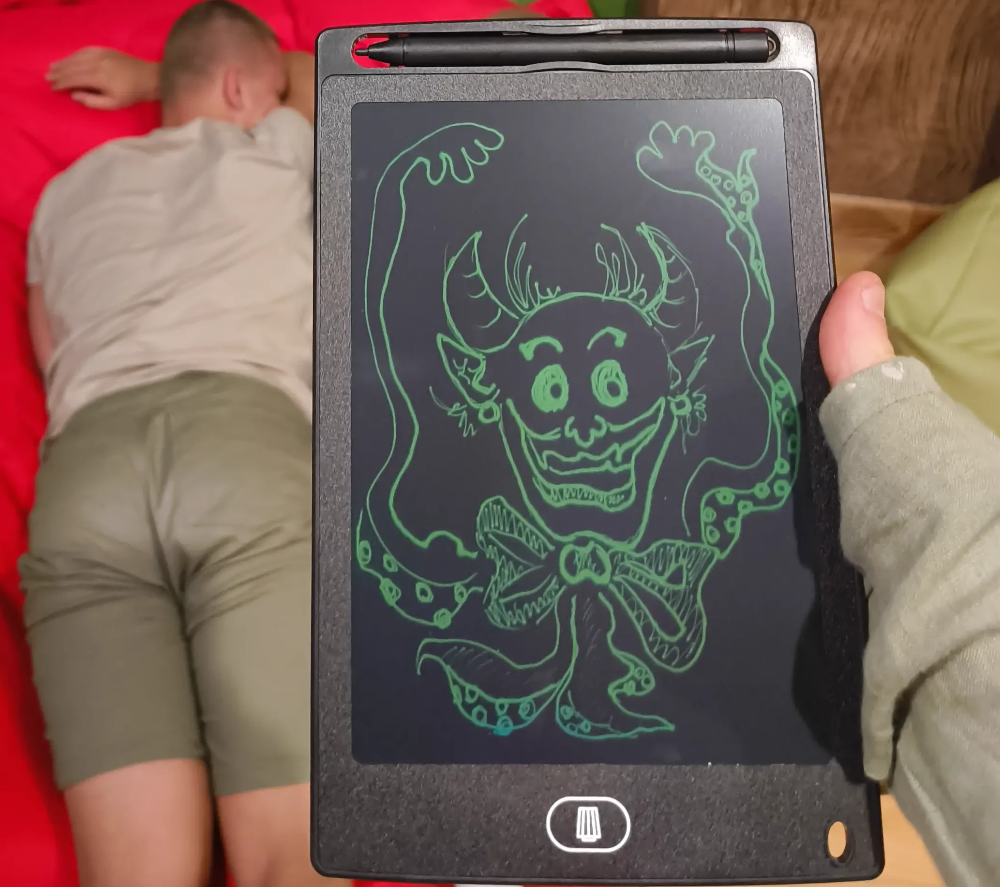
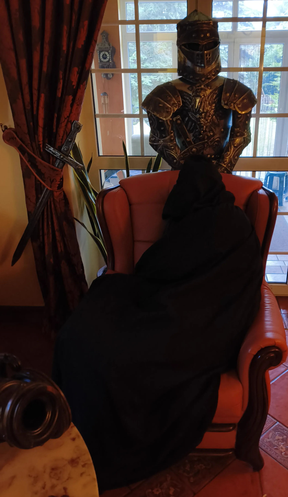

Rok temu świat stanął w płomieniach. Teraz więc czas nadszedł na Miraże z Popiołów. Co okazało się być prawdą a co jedynie iluzją? Przekonaliśmy się zbierając tej nocy w 15 osób!

Była to niezwykle spokojna noc, może nie licząc zaników światła - echa sprzed roku - czy presji wywołanej potencjalnie niechcianymi goścmi albo paroma osobami forsującymi swoje zdanie. Nawet potwory które powołaliśmy do życia, i których nie udało nam się zamienić w popiół nie sprawiły tylu problemów. Co więc się wydarzyło?

Rozpoczęliśmy dosyć skromnie, pierwszy przybysz zjawił się 8 minut po 18. Korzystając ze sposobności, zapytał mnie o plany Podróżnika - wieść że wybiera się tym razem na północ zdążyła już obiec okolice.

# Rozmowy Kuchenne

Rozprawialiśmy więc o przygotowaniach jakie są do poczynienia, dostępności parowozów oraz wszelkich innych rzeczach które mogłyby się przydać na szlaku gdyby ktoś planował podobną podróż. W trakcie naszej rozmowy, 7 minut przed 19, zjawili się następni goście z którymi kontynuowaliśmy ową rozmowę o podróżach.

Gdy rozmawialiśmy, jedna z nowo przybyłych gości zapytała mnie jak wygląda mój cykl snu ostatnio. Odpowiedziałem że to dalej stabilna sinusoida, stabilnie idąca ku porankowi i wracająca w okolice środka nocy.
Zapytała: "A rozważałeś napicie się melatoniny?"

"Eee... niezbyt, w końcu co jest zdrowsze - stabilna niestabilność, czy niestabilna stabilność?"

"PRZECIEŻ TEN CYKL W OGÓLE NIE JEST STABILNY"

"No właśnie! Jest stabilnie nie stabilny, jak sinusoida! A nie skacze góra dół 
non stop!" - odparłem.

Niedługo później zjawiła się podróżniczka z sąsiedniego królestwa, którą to poznałem niedawno gdy dorabiała jako Inkwizytorka podczas ostatniego Festiwalu Magii w trakcie śledztwa podczas powtórnego zaginięcia tamtejszego alchemika. Pół godziny później pojawiła się Szeryfka. Po niej zjawily się jeszcze dwie osoby, a my dalej siedząc w komnatach kuchennych kontynuowaliśmy nasze debaty które lekko zahaczyły o tematy psychoaktywne jak na miraże przystało, po czym obróciły się w proch niczym popiół i skończyły na sekt... sekcjach, sekcjach zwłok.

# Kapelusz Komnaty

Gdy tylko temat umarł, postanowiliśmy usiąść w głównej komnacie gdzie na chwilę jeden z bardziej doświadczonych gości w temacie uraczył nas prelekcją o różnicach w rodzajach nielegalnych substacji. Następnie wyciągając pytania niczym z kapelusza, odpowiedzieliśmy sobie na kilka pytań by przełamać lodowatą atmosferę gdy od rozmów o trupach zaczęliśmy widzieć obłoki pary. I to w środku lata nie będąc w odwróconej mitycznej krainie z wielkimi potworami snującymi nici niczym sny po drugiej stronie globu, ani pod wpływem substancji.

W trakcie pytań, Szeryfka powiedziała o chemii jako jednym z przedmiotów na uniwersytecie, natchymiast się ożywiłem gdy usłyszałem "Alchemia". Mocno mnie to zdziwiło - wydawało mi się że obecnych czasach był to przedmiot zakazany. Gdy tylko dowiedziała się co usłyszałem, odpowiedzała ze na zaliczenie musieli kamień filozoficzny ogarniać więc właściwie to mogła i być Alchemia.

Następnie, spragniona, zapytała: "Co to za lekko zaczerwieniony sok w dzbanku?"
"Krew Elfa" - odparłem, po czym ciszej do reszty dodałem - "tylko nie mówcie że wcale tak nie wygląda krew elfa bo się zorientuje."

W połowie kapelusza, dołączyły do nas trzy następne osoby, godzinę od poprzedniego gościa. Następnym razem chyba naprawdę powinienem poinformować że od 20 wrota zostaną zamknięte i aby próbować oknem...

Kontynuowaliśmy pytania, były one tak jak i odpowiedzi przeróżne - od tego jak to jedna z gości ostatnią książkę jaką czytała była o cmentarnym składanym potworze ożywionym błyskawicą, przez polecane miejsca będące pewnym zamkiem, co wywołało zainteresowanie dwójki przybyszów którzy to zwiedzali wszystkie okoliczne zamki, a nawet odpowiedzieliśmy sobie co gdyby światem rządziły kamienie co wywołało reakcję u praktycznie wszystkich zebranych, kończąc na prozaicznych rzeczach jak instrumenty na których niektórzy grywają.

W między czasie, musiałem również rozwiązać kwestię z pewnym potencjalnym gościem który nie był do końca zapowiedzianym przybyszem, lecz drogą dyplomacji udało się to ryzyko zażegnać.

# Świece Przeszłości

Około 21:34 echa przeszłości nadeszły - Dookoła nas zapadł zmrok. Szeryfka zapytała czy to jest ten moment gdy ktoś umiera, lecz coś było nie tak. Coś było mocno nie tak. Kręgi ochronne nie były naruszone, lecz zmiana w otoczeniu była wyczuwalna. Ktoś powiedział ze światło zgasło również i na ulicy. 

Na stole stał kandelabr który rozpaliliśmy korzystając z podręcznego ognia podróżniczki, a dodatkowo rozpaliliśmy świecie znajdujące się w pustych butelkach.

Było coś urokliwie pięknego w takim obrocie spraw, a dusza romantyka aż pokusiłaby się o stwierdzenie że mogłoby to być i romantyczne. Przybył Bard wraz ze swoim instrumentem by zapewnić nam muzykę na żywo, gdy zaklęcie muzyki otoczeniowej umarło wraz ze światłem.

Klimat skłonił gości do głębszych rozmów o charakterze samym w sobie. Gdy Szerfyka skończyła opowiadać swoją historię, postanowiłem zabrać głos by odpowiedzieć na pytanie o sytuacjach które diametralnie wywróciły życie które wiodłem.

Było to nieco ponad dwa i pół lata wczesniej, gdy poznałem Skrzydłowego. Wtedy jeszcze tego nie wiedziałem, lecz to wydarzenie rozpoczęło efekt domina który doprowadził do tego miejsca i spotkania teraz w obecnym gronie. Wtedy też moje poprzednie życie się skończyło, a dziewięć miesięcy później Podróżnik wyjechał w daleką podróż poszukując siebie.

*(A może po prostu ten nieśmiertelny zaczął być znudzony poprzednim życiem, postanowił więc wywrócić je o 180 stopni wyruszajac w drogę do odległych krain, by po powrocie, jak na megalomaniaka przystało wyprawiając hedonistyczne biesiady doprowadzić do postawienia świata w płomieniach rok wcześniej?)*

Być może nicie Przeznaczenia zostałyby uplecione inaczej, i do tego spotkania i tak by doszło, być może było to zaplanowane, a być może nie? Kim jesteśmy, by jasno określić czy jesteśmy czymkowliek ponad pionkami na szachownicy czasu?

9 miesięcy oddalenia między tymi wydarzeniami zaiskrzyło pewne komentarze od słuchaczy. Wspomniałem również że jedno wydarzenie zachowam dla siebie. Prawdę mówiąc, przemilczałem to które wydarzyło się mięj więcej pomiędzy oboma owymi wydarzeniami. Skrzydłowy mógł ustawić scenę, lecz to dopiero następne wydarzenia sprawiły że reakcje łańcuchowe zostały wprawione w ruch.

Gdy Szeryfka usłyszała o podróży, myśląc że nawiązuję do tej podróży w której miała wziąć udział rok wcześniej wspomniała ze mogła być odpowiedzialna za tą samotną wyprawę, więc też trzeba było temat wyjaśnić.

Nagle światło powróciło, lecz postanowiliśmy dla klimatu pozostać przy świecach. Chwilę później zjawiła się następna trójka gości którzy gdy dowiedzieli się o naszej sytuacji sprzed chwili, wspomnieli że w trakcie swojej drogi również doświadczyli czegoś podobnego. A więc było o wiele gorzej niż się spodziewałem. Nie zapytałem jednak czy w trakcie swej podróży nie napotkali przypadkiem dorożki bez jeźdzca...

Po zaprowadzeniu ich do reszty, znowu pojawił się temat sekty... udałem się więc do komnat na górze po odpowiednie rekwizyty - płaszcz i maskę. A gdy pojawiłem się ponownie... Wcale nie jesteśmy sektą™. Gdy jednak podniosłem ceremonialnie kandelabr, wosk skapał na jeden z moich rękawów. Ah, tak się kończy zabawa z ogniem i drobne teatralne zapędy...

Pojawił się również temat 16 osobowości, lecz nas było jedynie 14. Byłem jednak ciekaw jaki jest rozkład sił - kogo nam brakuje? Niestety, nie udało nam się odpowiedzieć na to pytanie, chociaż parę osób skłoniło się ku rozwiązaniu owego testu by poznać odpowiedź.

W trakcie tych rozważań, zjawił się Gadatliwiec, ostatni z gości. Bard zwolnił mu miejsce do siedzenia, a sam zadowolił się na podłodze, lecz Gadatliwiec miał delikatne obiekcje. Finalnie jednak dał za wygraną i zajął zwolnione mu miejsce.

Kontynuowaliśmy więc rozmowę o osobowościach, i ilu jest Dyskutantów w gronie. Szeryfka została zapytana czy w rozmowach przybiera pozycję Adwokata Diabła, jako że jest to częste zjawisko przy takim typie.

Po chwili rozmowy pojawiło się następne pytanie odnośnie powtarzalnych schematów w życiu. Szeryfka opowiadała o swoich znajomościach i tym jak reputacja którą sobie zaskarbiła u ludzi nie była zbyt pozytywna. Ponownie zabrałem głos, jako że był to temat o którym osobiście sam miałem przemyślenia już wcześniej.

Bard wsłuchany w opowieści, zapętlił się w swojej przygrywce na co jeden z gości zareagował: "Bardzie, weź że dorzuć trzeci akord!", na co ten w odpowiedzi niczym zbudzony z nagłego snu zariffował.

Wspomniałem więc że ostatnio mam trzy miesięczny cykl znajomości, po którym relacje się rozpadały a mój styl życia ulegał zmianie. jedna osoba ze Starszyzny coś o tym wiedziała i sympatyzowała z tym, natomiast druga wspomniała że do utrzymania relacji wymagane są trzy pilary: Czas, Miejsce oraz Zainteresowania.

Cóż mogłem rzec, z listy wszystko było odhaczone - niektórzy jednak uznają interakcje ze mną za zbyt intenstywne. Podróżniczka natomiast wspomniała iż relacja rzadsza tak naprawdę nie jest dłuższa a jedynie rozciągnięta *(niedosłowny cytat, poprawienie mile widziane; przyp. red.)*

W każdym razie, właśnie te relacje upadały w kadencji sezonowej - ze wszystkimi trzema pilarami. Gadatliwiec zapytał czy przypadkiem nie staram się mieć jak najwięcej relacji swoimi poczynaniami i aktywnościami, na co odpowiedziałem że właściwie to nie bo nie ze wszystkimi których poznaję utrzymuję kontakt, a dobieram swoich towarzyszy.

Świece się jeszcze paliły, niektórzy zastanawiali się co dalej, zaproponowałem że gdy dopalą się świece, moglibysmy urządzić mini warsztaty wytapiania czekolady - w kuchni miałem takowy blok do przetopienia. Chociaż nie spotkało się to ze zbyt wielkim odzewem, więc nie kontynuowałem tematu.

Na stole były pianki, a my mieliśmy płomień w świeczkach - postanowiłem więc spróbować. Znalazłem patyczki którymi nabiłem piankę, po czym spróbowałem opiec jedną nad świeczką. Niestety, od kontaktu z ogniem natychmiast stała się czarna, a jeden z gości który stał obok natychmiast powiedział aby tego nie jeść. Do zanotowania: nie dotykać pianką ognia.

Jako że przyniosłem więcej patyczków, kilka osób też skusiło się na spróbowanie pianek ze świeczki, zaraz po tym jak przetarłem szlak.

# Letnie Powietrze

Od jakiejś chwili, parę osób poszło zaczerpnąć świeżego powietrza, i coraz więcej pozostałych do nich dołączało, natomiast jeden z gości uznał że będzie się zbierał. Gdy odprowadzałem go do bram, zapytałem skąd ta nagła decyzja. Ton głosu odpowiedzi ociekał mocnymi emocjami zakrawającymi wręcz o agresję, odpowiedział że to nie był jego klimat, ani ludzie.

Powracając do gości, spotkałem Gadatliwca przy bufecie, gdzie zamieniliśmy słowo, oraz skosztowaliśmy wykwitnego towaru: czekolady, z dalekich rejonów Angoli, która to podejrzewałem że była przywieziona z podróży z okolic bliskiego wschodu bądź pustyni na południu. W konwersacji mój rozmówca jednak myślał że miałem na myśli zielony rodzaj tamtejszego przysmaku.

Na chwilę udałem się do komnaty orzeźwień, a w drodze powrotnej spotkałem Szkicowniczkę która szukała swojego odzienia wierzchniego. Wspomniała że chciała zaprezentować pochłanianie światła. Zaprowadziłem ją więc do wieszaka gdzie je zostawiła, a następnie zaciekawiony tym artefaktem podążyłem na zewnątrz.

Tam, gdy się odziała i oddaliła w mrok, zniknęła - niczym gdyby miała na sobie kamuflaż optyczny. Poprosiliśmy więc by na chwilę go zdjęła, po czym nagle zmateralizowała się po drugiej stronie ogrodu, znowu widoczna.

Wraz z jednym z gości którzy niedługo się planowali zbierać udałem się do środka by porozmawiać. Niedawno, w drodze na Festiwal Magii, napotkałem kogoś kto znał mojego rozmówcę, nie miałem okazji jednak zapytać tamtej osoby, toteż korzystając z okazji teraz postanowiłem zaspokoić ciekawość i zapytałem skąd się znają. Okazało się że z pewnej Karczmy (która miała swe problemy), gdzie oboje dowiedzili się że mieszkają w tym samym mieście, lecz finalnie nie było im po drodze. Brzmi prawie jak moja historia z pewnym Najemnym Strażnikiem sprzed lat.

Rozmawialiśmy również o metodach informowania o wydarzeniach. Wysyłanie kruków po wszystkich bywa uciążliwe, a gołębie, tanie co prawda, są uznawane za niechcianą pocztę której nikt nie sprawdza. Padła jednak propozycja by po potwierdzeniu obecności w liście zwrotnym znajdowała się forma skrzekacza kalendarzowego. Jest to pewnego rodzaju rozwiązanie, chociaż mam wątpliwości nad rzeczywistym użyciem takiego skrzekacza przez osoby które potwierdziły obecność...

Zbliżała się północ, więc i dwójka gości się zbierała. Gdy odprowadziłem ich do bram, ponownie natknąłem się po drodze na Szkicowniczkę, która tym razem szukała swojego szkicownika. A gdy go znalazła, powiedziała ze planuje stworzyć potwora rysując część, zawijająć i przekazując dalej.

Spotkałem się z czymś podobnym już wczesniej - Odpowiadało się na pytanie, zawijało, przekazywało i następna osoba odpowiadała na następne pytanie. Goście których odprowadzałem powiedzili że mam już w takim razie na następne wydarzenie potencjalną listę aktywności.

Gdy opuścili posiadłość, Szkicowniczka chciała bym narysował pierwszą część. Prawdę mówiąc, planowałem zacząć od oczu - proste kształty, w ostateczności jedynie nabawię kogoś o koszmary, lecz okazało się ze zacząłem od samej góry, a co za tym idzie - Oczy były na szczycie. Niekoniecznie zamierzony efekt.

Dołączyliśmy do pozostałych na ogrodzie, gdzie byli już prawie wszyscy poza trójką gości. Postanowiłem zabrać Kandelabr, by w ramach Mistycznych Wydarzeń Ognia i Popiołu mieć ogień i tutaj.

Potrzebne było jednak miejsce gdzie można by go postawić. Nieopodal leżał pniak który udało nam się położyć bliżej na którym postawiliśmy kandelabr. Jednak położenie było trochę nierówne, przez co dwa z pięciu płomieni zgasły na dogasających świeczkach.

Potwór został ukończony. Oświetliliśmy go światłem płomieni, lecz nie zamieniliśmy jeszcze w popiół. W między czasie zajrzałem do pozostałych gości w środku. Jak się okazało, dyskutowali przez magiczny kamień z kimś kto starał się zdobyć czyjeś serce za pomocą długości... Nope, wracam do pozostałych. Tam też Bard zaczął grać na swoim instrumencie, w trakcie gdy drugi potwór był współtworzony przez obecnych.

# Potworny Atak

Długo to jednak nie potrwało, ludziom zaczęło być zimno więc powróciliśmy do środka, tam też został potwór dokończony i przedstawiony. Była to chwila oddechu która została natychmiast wykorzystana do wywarcia presji na mnie by zebrać tłum do następnej aktywności. 

Padły głosy na pijackie zabawy z butelkami, lecz nim do tego doszło raz jeszcze zgasło światło tej nocy. Przebudziły się Potwory które powołaliśmy do życia, a ja po raz trzeci przyjąłem na siebie atak w mroku. Pogranicze życia staje się coraz bardziej znajomym miejscem, a zaktualizowane zabezpieczenia mam wrażenie jakby sprawiały że są to coraz mniej spektakularne akcje... Wewnętrzny zew teatralności jednak woła o pomstę, bowiem skoro już jestem przygotowany to chociaż mógłbym odstawić godną inscenizację...

Niemniej jednak, ktoś się przejął, pomijając narzekania w tle na światło, więc też nie zwlekając powróciłem, rzuciłem tylko że byłem martwy po czym należało odegnać miraże i znaleźć kto mógł być za to odpowiedzialny.

Lecz miraże które wśród nas się zebrały... Świnka Morska, Szczur, Handlarz, Chodowca i Łowca świnek morskich... Takiej fazy przy przechodzeniu przez wrota śmierci to jeszcze nie miałem...

Jak się okazało, Łowca Świnek Morskich, próbował zabić Chodowczynię Świnek Morskich zakochaną w śwince morskiej, prawdopodobnie by zażegnać problem zwiększającej się populacji tychże stworzeń. Jednak, ktoś dolał mu coś do drinka, więc ten chybiając strzelił do Świnki Morskiej która jak się okazało, celowała w Szczura który był jedynie Błaznem grupy. Jednak, szczur był chroniony przez... Handlarza Świnek Morskich.

Głosy były za pozbyciem się szczura, lub łowcy który również sprawiał wrażenie podejrzanego. Finalnie, to własnie łowca został skazany - miraże się rozpadły, a światło powróciło. Brrr.... to była doprawdy przedziwna faza...

Szkicowniczka do mnie podeszła z wnioskiem aby jako że jest Popiół w nazwie, to by spalić narysowane potwory w Ogniu i uniknąć podobnych sytuacji ponownie. Było to sensowne, chociaż wydawało mi się że wyciąganie ludzi teraz na zewnątrz by je spalić może być brutalnie nie przyjęte. Myślałem nad tym aby zrobić to później

# Oddetchnięcie Szaleństwa

Postanowiliśmy dołączyć do reszty w komnatach na górze, tam też zapytałem czy byłyby chętne osoby na rozstawienie Iluzorycznych Szranek, lecz niestety, publiczność wydawała się martwiejsza niż żywsza. Chyba nie tylko ja zaliczyłem niedawno zgon...

Uwagę podróżniczki przykuła moja biblioteczka gdzie siedząc obok kilku pudełek wyczuła pewien delikatny zapach. Trochę mnie to zbiło z tropu, te rzeczy były tam już parę lat - od czasów gdy światło umarło po raz drugi; relikty z mojego poprzedniego życia gdy odwiedzałem siedzibę organizacji Technologicznej Ziemii - i nie spodziewałem się że dalej będą wyczuwalne.

Otworzyłem więc owe pudełka i zapytałem czy być może to jest to co czuje. Zdziwiła się że są w stanie nieruszonym przez tyle lat, jedynie odparłem wtedy że nie miałem okazji by ich użyć.

Zacząłem odnosić wrażenie ze jak nie dostarczę jednak butelki pewnej osobie to mogę skończyć zadźgany, więc też zgarnąłem jedną którą miałem pod ręką.

Ludzie ułożyli się mniej więcej w koło, chociaż było trochę bardziej kształtu jajka. Butelka nie była zbalansowana i tak naprawdę większość rund tylko powtarzająca się garstka osób uczestniczyła. Wstałem by przesunąć jeden instrument i pozwolić na bardziej foremne koło. Bard wyjął z szuflady kostkę po czym wrócił na miejsce, a w między czasie Podróżniczka przysiadała się obok niego gdy dwie osoby na chwilę odeszły. 

Przebieg tejże butelki szedł doprawdy mozolnie, Bard zaczął się więc bawić kostką, Podróżniczka natomiast go zaczepiać. Zaczął to kontrować i również ją... zaczepiać? Odczepiać? Szkicowniczka skomentowała ich poczynania jako flirtowanie.

Butelka wykręciła na Barda, pytanie było krótkie, tak samo jak odpowiedź, po czym zamiast zakręcić butelką, wciąż na zmianę tykając się z podróżniczką, rzucił kostką w ramach dywersji na drugą stronę kręgu  - wypadła dziewiątka. Przeliczył osoby kto jest dziewiątą osobą, po czym rzucił ponownie. Była to większa liczba niż osób w kręgu, więc liczenie było podwójne. Wywinął się w ten sposób od zadawania pytania - druga wylosowana osoba zadała pytanie pierwszej wylosowanej osobie, podczas gdy on mógł wrócić do zażartego pojedynku który własnie toczył.

Szeryfka stwierdziła ze ta kostka była sprawniejsza w butelce niż sama butelka, więc odstawili niezbalansowaną butelkę i zagrali kilka rund kostką. 
Jednakże, energia kręgu była niska, przynajmniej cztery osoby zezgonowały do snu. 

Zostałem zapytany czy mam biesiadne pudełko gier J. Właściwie to nie miałem, ale można było temu zaradzić. Przestawiliśmy inkantacje do Karaoke na tryb Arkadowy, a następnie spróbowaliśmy ustawić pudełko. Okazało się jednak że osobiście nie miałem odpowiedniej inktantacji w swoich księgach Pary. Mój towarzysz jednak takie miał - trzeba było jednak zawiązać pakt krwi. 

Jak się jednak okazało, do zawiązaniego takiego paktu, obie księgi Pary muszą być blisko siebie, co było niewykonalne. Zamiast tego, od razu przywoływał własną księgę Pary z której to spróbował wyrysować inkantacje Biesiadnego Pudełka.

W trakcie gdy się tym zajmował, Podróżniczka zwinęła się w kulkę przy schodkach. Bard zaoferował jej początkowo shemagh którym to okrywał się gdy nie miał koca - jako że był wystarczająco duży - podczas Festiwalu Magii. Jednak stwierdził że płaszcz będzie bardziej adekwatny do tego zadania, podczas leżenia na podłodze. Udał się więc po niego, a gdy powrócił, Podróżniczka prawie natychmiast wtopiła się w niego. Jedno jej trzeba przyznać - Zwiadowczą lekcję "Zaufaj Płaszczowi" przyjęła do serca.

Szkicowniczka natomiast zajęła się szkicowaniem karykatur różnych osób obecnych w oczekiwaniu na inktantacje. Z nimi nie szło jednak najlepiej - był jakiś problem z magicznym połączeniem do kamieni. Próbowaliśmy również innych inktantacji, z innymi pudełkami, lecz finalnie nic nie dało rady. Szeryfka postanowiła wrócić do głównych komnat i kimnąć się w ciszy. 

Gadatliwiec pomyślał o inkantacji symulacji biznesu, znalazł ją w mojej księdze Pary po czym poradził sobie z jej rozstawieniem bez większych problemów. Znawca. Towarzyszka z którą większość wieczoru rozmawiał miała się zbierać by móc towarzyszyć swojemu wybrankowi na mieście podczas gry na instrumencie następnego dnia. 

Gadatliwcowi jednak udalo się ją przekonać by zagrała z nim rundę symulacji. W między czasie, na korytarzu przed, Bard zagrał kawałek swojej piosenki poproszony przez Szkicowniczkę, która to również zajmowała się śpiewem. Gdy Podróżniczka to usłyszała, również przyszła bliżej by posłuchać. Słowa z którymi walczył ponad rok w różnych wersjach utworu zostawiły go bez ładu z jedynie refrenem, więc zajął się improwizacją następnych słów, dosłownie śpiewając o tym że zaczął improwizować, byle tylko utrzymać motyw.

Szkicowniczka określiła głos Barda jako momentami nie pewny, szczególnie pod koniec - czyli dokładnie tam gdzie improwizował, lecz nie wsłuchała się w słowa z tego co mówiła. Na chwilę oddalił się po coś do komnaty, co tylko wywołało u Podróżniczki zawołanie by wracał.

Po pół godzinie rozgrywki, Gadatliwiec ze swoją towarzyszką wygrali 5.5m do 0.5m. Silna para się dobrała... Chociaż to stwierdzenie jedynie wywołało pomstę że ona ma już wybranego. Następnie ta dwójka nas opuściła.

Gdy Bard z Podróżniczką kontynuowali swój pojedynek, momentami przypominający taniec, na uniki i tyknięcia, Szkicowniczka rzuciła że takie tykanie raz skończyło się ślubem.

Bard korzystając więć z okazji, wydobył z sakiewki pudełeczko po czym przyklęknął na jedno kolano otwierając je, z pierścionkiem w środku. ~~(Kiedyś może kogoś znajdzie na tą zdobycz Łotrzyka...)~~

# Bis

Uznaliśmy to za idealny moment by rozstawić Inkantacje Karaoke. Było już po czwartej, i oczy zamykały się jeszcze jednej parze która to postanowiła nazwać to nocą i udać się w swoją stronę, toteż ich odprowadziłem, jednocześnie przekonując osobę która była na pograniczu, by została. 

Gdy trzecia osoba z ich tercetu finalnie zdecydowała się zostać, mnie doszły wieści o konflikcie z inną osobą. Będąc osobą która preferuje konfrontację bezpośrednią, ~~a w szczególności gdy nie jestem po żadnej ze stron konfliktu,~~ zaproponowałem że kwestie należy wyjaśnić i abyśmy wrócili do pozostałych by temat domknąć. Nie było to czymś co chciała zaczynać ta osoba jednak, lecz udała się razem ze mną do pozostałych. 

Tematu jednak nie poruszyłem od razu, z jednej strony czekałem na odpowiednią chwilę, z drugiej... na pewne konfrontacje jest czas i miejsce. To nie było ani jedno ani drugie jeszcze.

Szkicowniczka zapytała mnie czy miałbym może coś do picia, jako ze zaschło jej w gardle. Zaoferowałem jej więc resztkę wody w bukłaku który był obok (ten sam użyty do gry w butelkę), lecz obawiała się że to jedyna woda i nie chciała mi jej wypijać. Podróżniczka rzuciła żeby brała oferowaną wodę, podczas gdy ja wyciągnałem drugi bukłak i powiedziałem że spokojnie, jest więcej ~~(więc nie marudź Szkicowniczko tylko pij)~~.

Zaczęliśmy więc śpiewać, po czym każdy z nas (a przynajmniej ci co jeszcze żyli) spróbował się z Wilczą Zamiecią. Nieswiadomie, i zdecydowanie nie celowo, okazało się że sabotowałem Podróżniczkę gdy Szkicowniczka pod koniec powiedziała ze było świetnie tylko za nisko. Po czym uznaliśmy że zamiast dośpiewać do melodii z przodu, dostroiła się do melodii z tyłu - czyli tam gdzie sam byłem.

Po czym, korzystając z tajemnej wiedzy jak czar punktuje wynik... Poszedłem po zieloną kombinację. Jak to mawiają... Dom zawsze wygrywa? Szkicowniczka wzięła mnie na stronę. Nie aby skarcić za kantowanie niczym w kartach, tylko w ramach lekcji śpiewu.

Tam wyjawiła mi kilka porad by rozluźnić szczękę, oraz śpiewać wyżej z wykorzystaniem czaszki, pokazując na czaszce Kostka o które partie jej chodzi. Biedaczyna musiał robić za przykład, zamiast klasycznie odpowiadać na pytanie być czy nie być... Chociaż kto wie, może nawet podobała mu się ta zmiana, trudno powiedzieć - nie rozmawialiśmy zbytnio o tej sytuacji później. Odniosłem wrażenie że mógł nie być z niej specjalnie zadowolony. Szczególnie gdy musiał zbierać szczęke z podłogi.

Reszta nie mogła znaleźć Innej Miłości, znaleźli tylko Inną Piosenkę - więc olali inkantację i zrobili własną by zwieńczyć Karaoke brakującym utworem.

# Tam gdzie wszystko się zaczęło...

Uznaliśmy że to dobry moment by pójść coś zjeść. A tak właściwie to po prostu byłem głodny i totalita... totalnie demokratycznie skłoniłem resztę że też tego chcą, nawet jeśłi o tym nie wiedzą. Udaliśmy się wiec z powrotem do głownych komnat, po drodze, zguba z góry wraz z drugą wciągnęły Szkicowniczkę do poważnych rozmów.

Później, w komntach kuchennych wraz ze szkicowniczką zajęliśmy się przygotowaniami ciasta do naleśników. Właściwie to przydział był otwarty, ale jak wszyscy wiemy, gdzie kucharek sześć, tam nie ma co jeść. Więc tak oto, 3 osoby dogorywały w salonie, Szkicowniczka mieszała ciasto (zaczepiście jej wyszło, mimo że ilość wydawała mi się trochę zbyt duża jak na miskę w której to robiliśmy), jedna osoba ogarniała w między czasie po-imprezowy bałagan a ja udawałem że wiem co robię przygotowując składniki i przedstawiając przepis.

Ciasto jeszcze nie było gotowe, więc zajrzałem do pozostałych w salonie. Tam podróżniczka, opatulona w płaszcz, niczym demoniczny cień drzemała pod zbroją Rycerza, a druga osoba próbowała na dwóch krzesłach obok siebie.

Pffft, #PodłogaTeżWygodna! Położyłem się na niej, przypadkowo urządzając zdarzenie które zainspirowało tę dwójkę do dołączenia na podłodze. Zbyt długo jednak nie poleżeliśmy, ponieważ obowiązki (a właściwie żołądek) wzywały - pora była upichcić potrawę.

Nim jednak się za to zabrałem - należało zebrać zamówienia! Zgarnąłem szkicownic za pozwoleniem, po czym udałem się niczym kelner do pozostałych - zadręczyć ich iluzją wyboru której tak naprawdę nie mieli: Słodkie czy wytrawne naleśniki?

Problem był jednak prosty - nie miałem absolutnie nic sensownego do słodkich naleśników. Przedstawiłem wybór i opcję wytrawnych, lecz nie zaiskrzyła wśród publiki. Gdy wróciłem do kuchni, zdałem sobie sprawę że jest jeszcze jeden rodzaj sera i suszonych owoców. Podróżniczka gdy się o tym dowiedziała, zmieniła zdanie właśnie na tą kombinację. 

Do jednego ze słodkich naleśników wrzuciłem kostki Angolskiej czekolady, mając nadzieję że się rozpuszczą. Przyznam, to nie był mój najlepszy moment jako kucharz, właściwie to jeden z gorszych. Ale co takiego mogło się wydarzyć? Nie wpuściliby mnie do kuchni więcej? Pfft! Dla niektórych brzmiałoby to jak wygrana!

Plan był zrobić dwa naleśniki każdego rodzaju - dwa wytrawne, dwa z suszoną żurawiną i dwa "słodkie". Skończyło się na tym że jeden słodki był z cynamonem, a o fakcie że miał być drugi z żurawiną zdałem sobie sprawę pod sam koniec, błędnie wyliczając ser do niego potrzebny, który to był dokrajany impromptu.

Informacja zwrotna jaką otrzymałem jedynie brzmiała że było to ciekawe połączenie. Czy było to ciekawe pozytywnie, czy ciekawe negatywnie? Grunt aby szef kuchni się o tej transgresji nie dowiedział.

Bard z Podróżniczką i tym razem postanowili kontynuować pojedynek na tyknięcia, coraz bardziej przypominający taniec, szczególnie będąc na parkiecie w głównej sali. Bard wtedy też zaczął opowiadać o swojej historii z tańcem w ostatnich miesiącach, oraz że wreszcie na coś mu się przydały te przeróżne lekcje które podłapał w rozmaitych miejscach przez ostatnie pół roku; czy to na tańcach tradycyjnych, czy to na improwizowanych, czy nawet towarzyskich.

Doszły mnie już kiedyś wieści że gluten działa usypiająco. Mi jednak było daleko do spania. Szkicowniczka wspomniała że następnym razem w takim razie trzeba przygotować śródziemnomorski makaron, wtedy mogłoby to nas rozłożyć do snu bez większych problemów.

Tuż po jedzeniu, jedna z osób oznajmiła że niedługo będzie miała wielokarocę i musi nas opuściła. Szeryfka też wstała, powiedziała ze nim zasnęła coś tam jeszcze słyszała z góry, między innymi perkusyjność instrumentu Barda jak grał parę godzin wcześniej i zastanawiała się co to, a po krótkiej rozmowie zaczęła się też zbierać w swoją stronę.

Podróżniczka postanowiła się finalnie zdrzemnąć tak bardziej. Wybadała więc teren kiedy powinna wstać, po czym udała się do komnat wyżej. 

Szkicowniczka również rozważała drzemkę, lecz finalnie wraz z pozostałą dwójką gości postanowili się zbierać - oryginalnie mieli nocować u znajomej, cała trójka jednak skończyła aż do 8 u mnie, więc uznali że nie ma co spać i wrócą od razu do siebie.

Niestety, przez noc finalnie nie udało nam się spalić potworów. Następnym razem trzeba będzie je złapać i zamienić w popiół odpowiednio.

Po ogarnięciu jako na dole tako i na górze posiadłości, i Bard postanowił się zdrzemnąć. Przyzwyczajony już do różnych miejsc, zadowolił się pufą na górze w celach zezgonowania, chociaż udało mu się złapać ledwo godzinę snu...

Spisuję te słowa, jak już zwykłem, po powrocie do życia, który tym razem trwał o wiele dłużej niż zwykle a uśpiona rana biegnąca przez serce Barda zaczęła pulsować niczym rwąca rzeka na mapie.

Taka oto jest kronika i opowieść o zderzeniu światów, przy ulicy miasta na pograniczu, w nocy z 11 na 12 lipca.  

                        ~ Podpisano, Wasz oddany kronikarz, arcymag i gospodarz.  

Ta noc minęła, a co gwiazdy przyniosą następnie? To się jeszcze okaże, a nam pozostaje zagrać pozostałe karty najlepiej jak możemy...